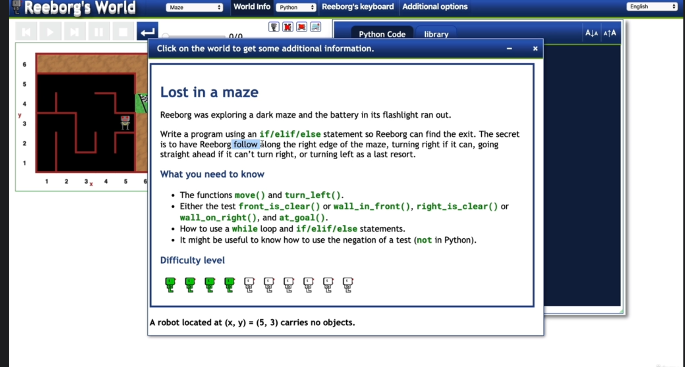
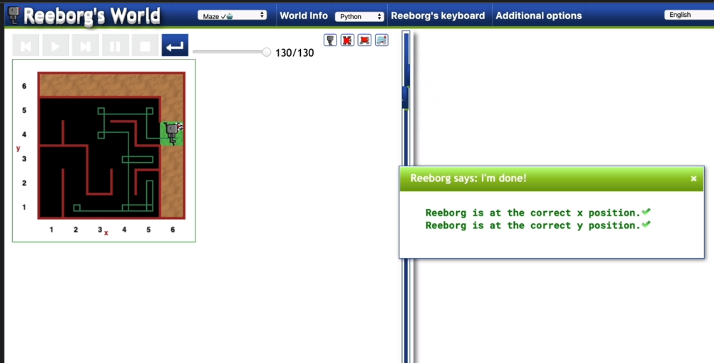
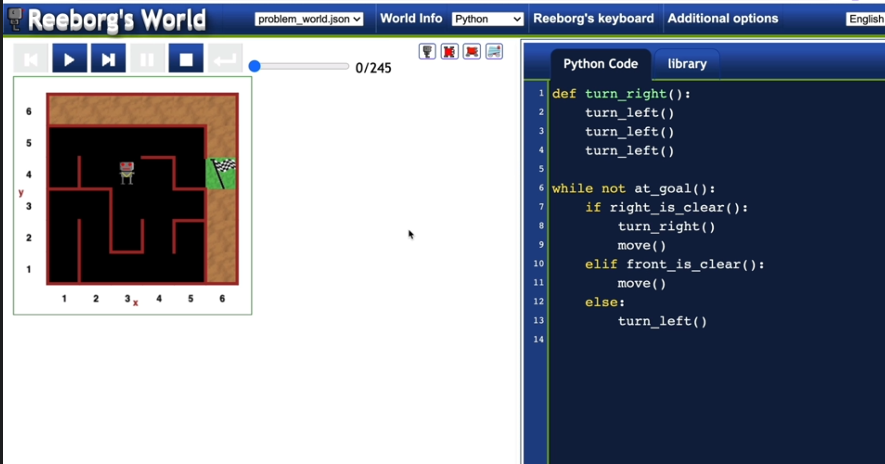
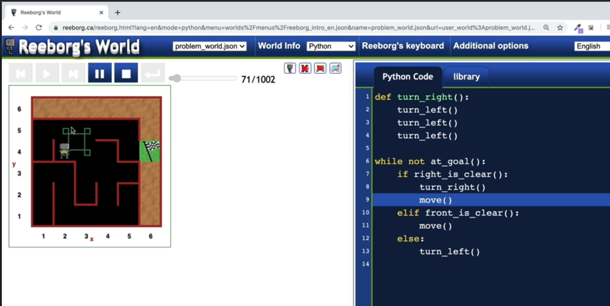

[REEBORG's World](https://reeborg.ca/index_en.html)

[Maze](https://reeborg.ca/reeborg.html?lang=en&mode=python&menu=worlds%2Fmenus%2Freeborg_intro_en.json&name=Maze&url=worlds%2Ftutorial_en%2Fmaze1.json)

This is edge case:

this is a debug challenge after Day 15,
after enough understanding of python,
come to the video 50, timestamp 9:31
