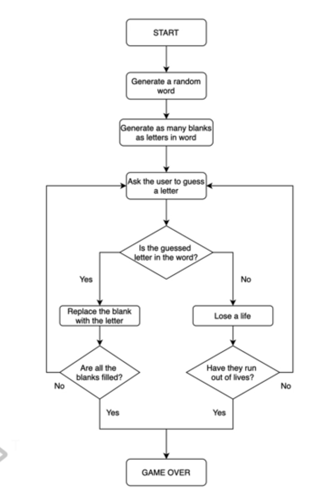

# How to break a Complex Problem down into a Fow Chart.

## Game Instruction and WIKI:

[Hangman (game)](<https://en.wikipedia.org/wiki/Hangman_(game)>)

[Link for the game for context](https://hangmanwordgame.com/?fca=1&success=0#/)

vid 53:

